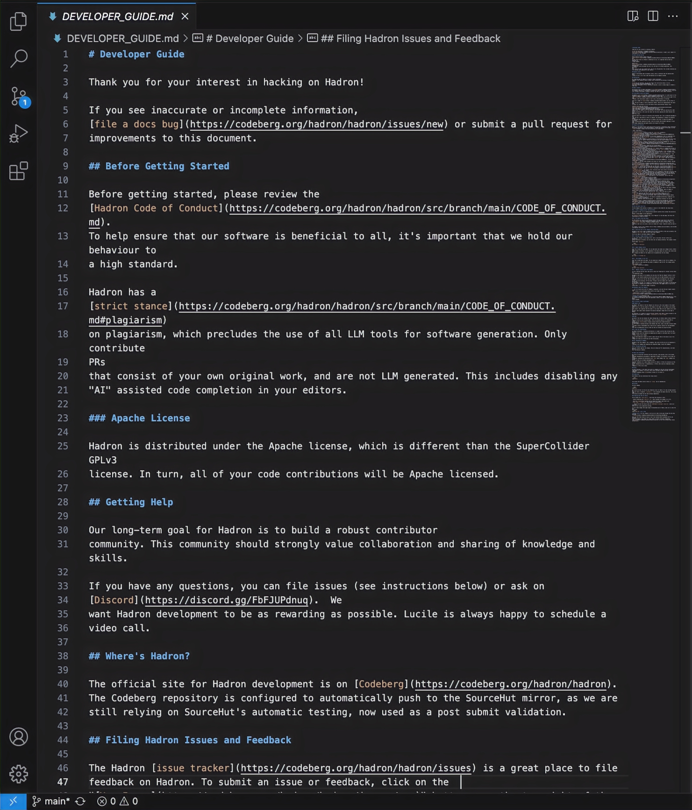
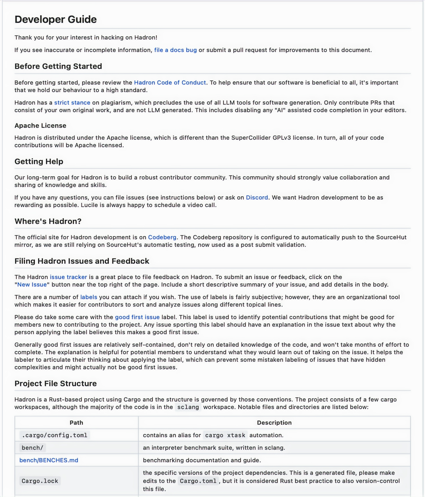

# Edited Open-source Documentation

## Source Code vs. Codeberg Rendering

## For more details, visit my portfolio https://stewartecleo.wixsite.com/portfolio

| Source Code | Codeberg Rendering |
|-------------|--------------------|
|  |  |

---

## Contributions
As the sole technical writer for the Hadron project, I was responsible for copyediting Hadron’s legacy documents, which included maintaining consistency across the documentation and establishing clear quality standards. During the copyediting process, I used Markdown markup language and stored all documentation in a Git repository. The final rendered files are now published and accessible on Codeberg.org.
​
One key deliverable included copyediting the "Developer Guide" shown above. The "Developer Guide" was designed to help new contributors effectively engage with the project. This guide provides developers with a clear outline of the contributor workflow, project file structure, issue reporting,  licensing rules, and more. 

---

## Challenges
One of the primary challenges I encountered was the project’s legacy documentation, which was hindered by inconsistent language and limited contributor-friendly guidance. To address these issues, I streamlined the content, established consistency, and introduced clearer standards to improve usability. Beyond content-related obstacles, I also adapted to working with Codeberg.com, a platform that is less commonly used in the industry, ensuring the documentation was both accessible and effectively maintained.

---

## Results
By standardizing the language  I transformed the documentation into a reliable resource that actively supports the developer community. The improved "Developer Guide" reduced onboarding time, minimized errors caused by unclear instructions, and established a professional standard for future documentation. In short, I helped turn the documentation from a barrier into an asset, saving the team time, increasing contributor confidence, and setting the project up for long-term success.
